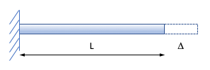
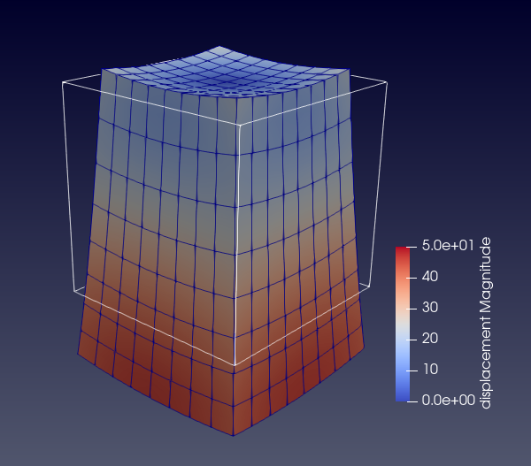
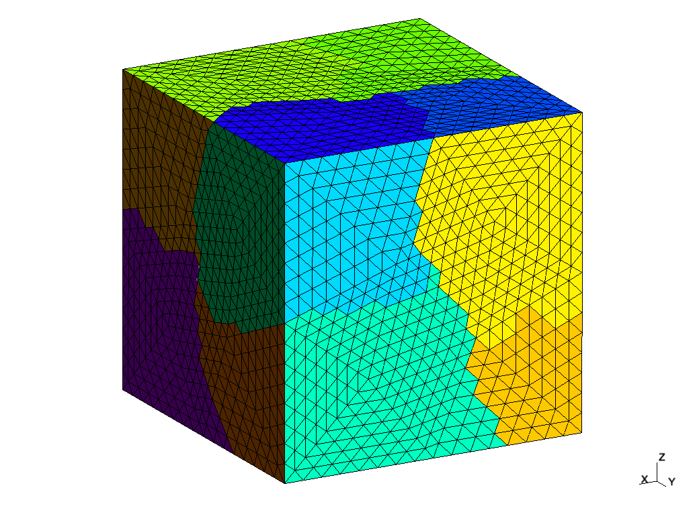

# What is aMat ?

aMat library supports the matrix-vetor multiplication (MATVEC) operator used in iterative solvers. It is designated for solving systems of linear equations resulted from the disretization of the domain to sub-domains called elements (e.g. the Finite Element Methods). It supports distributed-memory (MPI), share-memory (OpenMP), and GPU-accelerated parallelisms. It also supports AVX512, AVX256, OpenMP SIMD vectorizations. The theoretical background of aMat the is the assembly-free matrix approach (AFM), which does not assemble the global matrix but performs elemental matrix-vector multiplications. Users provides the discretization maps and element matrices, then AMat performs MATVEC operator v = K*u, where K is the global matrix (as it is assembled in standard fully matrix-assembled methods) and u is the initial guess vector of nodal degrees of freedom (DoF).

# Get aMat
You can clone the code from this repository.

# Build aMat
You need following external packages
* C/C++11 or higher
* MPI implementation
* PETSc (if BUILD_WITH_PETSC)
* BLAS/LAPACK (if USE_BLAS_MATVEC)
* CUDA, MAGMA (if USE_GPU)
* CMake

The provided *CMakeLists.txt* can be used to build aMat for the examples described below.
# Structure of aMat
The basis of aMat includes three templated classes:
* aMat: abstract parent class of aMatFree and aMatBased
* aMatFree: derived from aMat, properties and methods of AFM approach and matrix-free approach
* aMatBased: derived from aMat, properties and methods for assembled-matrix approach (PETSc)

and an independent class to support GPU option for aMat:
* aMatGpu: properties and methods for using GPU to accelerate the MATVEC operation

Besides, aMat library provides supporting classes:
* GmshMesh: read in the (partitioned) global mesh generated by Gmsh (.msh file), pre-process and provide the maps ready for the Maps object (described below)
* Maps: given the global or local dof map of my rank, number of owned elements, number of owned dofs, and map from element Id to number dofs per element, Maps build the scatter map and all other data structures needed for MATVEC operation of aMat.
* Functions to operate on PETSc vectors and PETSc solver for assembling the RHS vector and solving the discretized system by solvers available within PETSc
* Functions to compute element matrix and load vector for various element types that are commonly used in FEM
# Examples
## example01
Solving 1D problem of an elastic bar (of length $L$ with material properties $AE=1$) by FEM, in parallel, with linear 2-node elements.

* Governing equation: $\frac{d^2u}{dx^2}=0$
* Boundary condtions: $u(0) = 0$ and $u(L) = \Delta$

The FEM solution is compared with the exact solution $u(x) = \frac{x}{L}\Delta$. To run the example:
>mpirun -np P ./example01a N M B S outputFile

* P ~ number of MPI tasks (must be <= n)
* N ~ number of elements used in the discretization (global, for all ranks)
* M ~ method to be used (0 matrix-assembed, 1 AFM, 2 matrix-free, 3/4/5 AFM with GPU)
* B ~ method for applying boundary conditions (0 identity method, 1 penalty method)
* S ~ number of streams (only matter if using GPU)
* outputFile ~ name of output file 

## example02
Solving 2D Laplace problem by FEM, in parallel, with linear 4-node quadrilateral elements
* Governing equation: $\frac{\partial^2u}{\partial x^2}+\frac{\partial ^2u}{\partial y^2} = 0$ where $x,y\in [0,1]$
* Boundary condtions: $u(0,y) = u(1,y) = 0; u(x,0) = \sin(\pi x); u(x,1) = sin(\pi x)\exp(-\pi)$

The FEM solution is compared with exact solution $u(x,y) = \sin(\pi * x) * \exp(-\pi * y)$. To run the example:
>mpirun -np P ./example02a Nx Ny M B S outputFile

* Nx, Ny ~ number of elements in x and y direction respectively
* other parameters are similar to example01

## example03
Solving 3D Poisson equation by FEM, in parallel, with linear 8-node hexagonal elements
* Governing equation:$\nabla ^2(u) + \sin(2\pi*x) \sin(2\pi y) \sin(2\pi z) = 0$
* Boundary conditions: $u = 0$ on the boundary

The FEM solution is compared with exact solution $u(x,y,z) = (\frac{L^2}{12 \pi^2}) \sin(2 \pi \frac{x}{L}) \sin(2 \pi \frac{y}{L}) \sin(2 \pi \frac{z}{L})$. To run the example:
>mpirun -np P ./example03a Nx Ny Nz M B S outputFile

* Nx, Ny, Nz ~ number of elements in x, y and z direction respectively
* other parameters are similar to example01

## example04
Solving 3D Poisson equation by FEM, in parallel, with unstructured mesh of linear 4-node tetrahedra elements generated by Gmsh. The governing equation, boundary conditions, exact solution are the same as example03. To run the example:
>mpirun -np P ./example04a M B S meshFile outputFile
* M, B, S are similar to example01
* meshFile is the mesh generated by Gmsh. Samples of Gmsh-generated mesh files for this example are in examples/Gmsh.

## example05
Same problem as example04, but using unstructured mesh of quadratic 10-node tetrahedra elements generated by Gmsh. Samples of Gmsh-generated mesh files for this example are in examples/Gmsh. To run the example:
>mpirun -np P ./example05a M B S meshFile outputFile
* M, B, S are similar to example01
## example06

Solving 3D elasticity problem by FEM, in parallel, with linear 8-node hexagonal elements: an elastic bar hung from its top-surface center and stretched under its own weight. A uniform traction $t_3=\rho g L_z$ applied on top surface. The FEM solution is compared with exact solution of displacement
* $u = -(\nu \rho g/E) x z$; $v = -(\nu \rho g/E) y z$; $w = (\rho g/(2E))(z^2 - L_z^2) + (\nu \rho g)/(2E)(x^2 + y^2)$

To run the example
>mpirun -np P ./example06a Nx Ny Nz M B S outputFile

* all parameters are similar to example03.

## example07
Same problem as example06, but using quadratic 20-node hexagonal elements (serendipity element). To run the example
>mpirun -np P ./example07a Nx Ny Nz M B S outputFile
## example08
Same problem as example06, but using unstructured mesh of quadratic 10-node tetrahedra elements generated by Gmsh. Samples of Gmsh-generated mesh files for this example are in examples/Gmsh.

To run the example
>mpirun -np P ./example08a M B S meshFile outputFile
